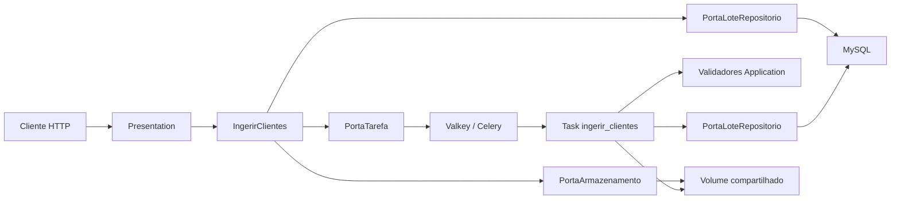

# Dependências entre Componentes

## Matriz de dependências

| De \ Para | Domain | Application | Infrastructure | Presentation |
|---|---|---|---|---|
| Domain | — | Não | Não | Não |
| Application | Sim (modelos + portas) | — | Não (só via portas) | Não |
| Infrastructure | Sim (implementa portas) | Sim (task chama validadores) | — | Não |
| Presentation | Não | Sim (casos de uso) | Não | — |

**Regra**: dependências apontam para dentro (Presentation → Application → Domain ← Infrastructure).

---

## Comunicação

| Par | Padrão | Contrato |
|---|---|---|
| Presentation → Application | Chamada síncrona in-process | Casos de uso |
| Application → Domain ports | Inversão de dependência | PortaTarefa, PortaLoteRepositorio, PortaArmazenamentoArquivo |
| Infrastructure → Domain | Adapter implements port | Mesmas portas |
| Infrastructure Task → Application | Chamada in-process aos validadores | Funções puras |
| Application/Infra → MySQL | Via LoteRepositorio | SQLAlchemy |
| AdaptadorCelery → Valkey | Protocolo Redis | Celery broker/backend |
| Api ↔ Worker | Mensagem assíncrona | payload {lote_id, caminho} |

---

## Fluxo de dados — ingestão (US-01 + US-02)



### Text alternative

```text
Cliente -> Presentation -> IngerirClientes
  -> salva arquivo (volume)
  -> salva lote PENDENTE (MySQL)
  -> enfileira task (Valkey)
Resposta 202 ao cliente

Worker consome task
  -> le CSV do volume
  -> valida linhas (Application)
  -> atualiza lote CONCLUIDO/ERRO (MySQL)
```

---

## Acoplamento a evitar

- Presentation não importa Celery nem SQLAlchemy
- Domain não importa FastAPI/Celery/pandas
- Validação de linha não vive na task (task só orquestra I/O + chama Application)
