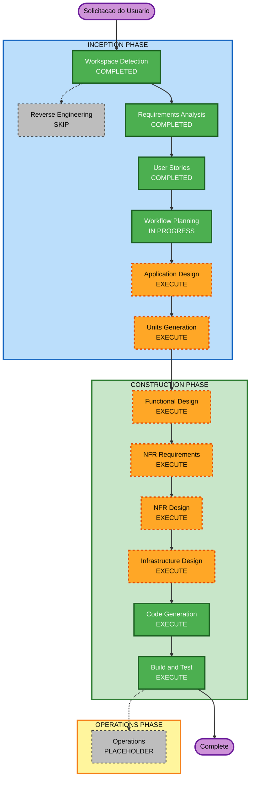

# Execution Plan — Serviço de Ingestão de Clientes

## Detailed Analysis Summary

### Transformation Scope
- **Project Type**: Greenfield
- **Transformation Type**: N/A (greenfield)
- **Primary Changes**: Novo serviço hexagonal de ingestão CSV assíncrona (MVP local)
- **Related Components**: N/A

### Change Impact Assessment
- **User-facing changes**: Yes — API REST consumida por Integrador, Analista e Operador
- **Structural changes**: Yes — arquitetura hexagonal nova (domain/application/infrastructure/presentation)
- **Data model changes**: Yes — tabela `lotes` no MySQL
- **API changes**: Yes — CRUD `/lotes` (POST/GET/PUT/DELETE)
- **NFR impact**: Yes — latência do POST, retry Celery, idempotência, logs, PBT, portabilidade Docker

### Component Relationships
N/A (greenfield). Componentes lógicos previstos:
- Presentation (rotas FastAPI)
- Application (casos de uso)
- Domain (`Lote`, `PortaTarefa`)
- Infrastructure (Celery, Valkey, MySQL, volume compartilhado)
- Compose (api, worker, valkey, mysql)

### Risk Assessment
- **Risk Level**: Medium
- **Rollback Complexity**: Easy (greenfield; descartar containers/volume)
- **Testing Complexity**: Moderate (API + worker + validação + PBT)

### Prior Context Loaded
- Requirements: `requirements.md` (Fase 1 MVP local aprovado)
- User Stories: US-01..US-06 Must; personas P1–P4
- Extensions: Security Off · Resiliency Off · PBT On (completo)

---

## Workflow Visualization

### Mermaid Diagram



### Text Alternative

```text
INCEPTION
- Workspace Detection .......... COMPLETED
- Reverse Engineering .......... SKIP (greenfield)
- Requirements Analysis ........ COMPLETED
- User Stories ................. COMPLETED
- Workflow Planning ............ IN PROGRESS
- Application Design ........... EXECUTE
- Units Generation ............. EXECUTE

CONSTRUCTION (por unidade)
- Functional Design ............ EXECUTE
- NFR Requirements ............. EXECUTE
- NFR Design ................... EXECUTE
- Infrastructure Design ........ EXECUTE (MVP local / compose)
- Code Generation .............. EXECUTE (always)
- Build and Test ............... EXECUTE (always)

OPERATIONS
- Operations ................... PLACEHOLDER
```

---

## Phases to Execute

### INCEPTION PHASE
- [x] Workspace Detection (COMPLETED)
- [x] Reverse Engineering (SKIPPED — greenfield)
- [x] Requirements Analysis (COMPLETED)
- [x] User Stories (COMPLETED)
- [x] Workflow Planning (IN PROGRESS — aguardando aprovação)
- [ ] Application Design — **EXECUTE**
  - **Rationale**: Serviço novo; ports/adapters, casos de uso, entidade `Lote` e contratos de API precisam ser desenhados antes do código
- [ ] Units Generation — **EXECUTE**
  - **Rationale**: Múltiplas camadas (API, worker, domínio, persistência); decomposição em unidades de trabalho reduz risco e alinha Construction

### CONSTRUCTION PHASE
- [ ] Functional Design — **EXECUTE**
  - **Rationale**: Regras de validação, ciclo de status, idempotência e propriedades PBT candidatas
- [ ] NFR Requirements — **EXECUTE**
  - **Rationale**: Latência POST, retry, durabilidade MySQL, observabilidade, PBT
- [ ] NFR Design — **EXECUTE**
  - **Rationale**: Segue NFR Requirements; padrões de retry/idempotência/logging
- [ ] Infrastructure Design — **EXECUTE**
  - **Rationale**: Docker Compose (api, worker, valkey, mysql, volume); AWS fora de escopo deste ciclo
- [ ] Code Generation — **EXECUTE** (ALWAYS)
  - **Rationale**: Implementação do MVP
- [ ] Build and Test — **EXECUTE** (ALWAYS)
  - **Rationale**: Build, testes unitários/integração e PBT

### OPERATIONS PHASE
- [ ] Operations — PLACEHOLDER
  - **Rationale**: Deploy/monitoramento AWS em fase futura

---

## Stages Skipped (with rationale)

| Stage | Reason |
|---|---|
| Reverse Engineering | Workspace vazio (greenfield) |
| Operations | Placeholder; AWS fora do MVP |

Nenhum outro estágio condicional pulado — cobertura completa para serviço novo com API + async + NFRs.

---

## Unit Preview (não vinculante — Units Generation detalhará)

Hipótese inicial (ajustável no próximo estágio):
1. **unit-dominio-api** — domínio, casos de uso, rotas CRUD, repositório MySQL
2. **unit-worker-validacao** — AdaptadorCelery, task, validadores, retry/idempotência

Dependência: worker depende do modelo/repositório de lotes.

---

## Estimated Timeline
- **Total Stages restantes (recomendados)**: 8 (App Design, Units, FD, NFR Req, NFR Design, Infra, Code Gen, Build/Test)
- **Estimated Duration**: 1 ciclo Inception restante + 1 ciclo Construction completo (MVP local)

## Success Criteria
- **Primary Goal**: MVP local operacional via `docker-compose` cobrindo US-01..US-06
- **Key Deliverables**: Código hexagonal PT-BR, compose, testes (incl. PBT validadores), docs em `aidlc-docs/`
- **Quality Gates**: Aprovação por estágio; AC das histórias; `POST` rápido; lotes terminam em `CONCLUIDO`/`ERRO`

## Extension Compliance (planning)
| Extension | Enabled | Applicability |
|---|---|---|
| Security Baseline | No | N/A — skipped by opt-out |
| Resiliency Baseline | No | N/A — skipped by opt-out |
| Property-Based Testing | Yes | Enforce from Functional Design through Code Gen / Build and Test |
