# Execution Plan — Fase 2 Migração AWS

## Detailed Analysis Summary

### Transformation Scope (Brownfield)
- **Transformation Type**: Architectural + Infrastructure
- **Primary Changes**: MVP local → AWS `dev` (Terraform, RDS, API Gateway, ALB, ECS Fargate, S3, ElastiCache, ECR); dual storage; task kwargs `{lote_id, bucket, chave}`; GHA apply automático
- **Related Components**: `libs/` (adapters), `api/`, `worker/`, `infra/` (Terraform), `.github/workflows/`, docs (dump/restore, rollback, smoke)

### Change Impact Assessment
- **User-facing changes**: Yes — URL do Gateway + API Key; mesmo contrato REST de lotes
- **Structural changes**: Yes — storage S3, rede VPC/SG, edge API Gateway, compute ECS
- **Data model changes**: No schema break (mesmo `lotes`); destino RDS + procedimento dump/restore
- **API changes**: Auth no edge (API Key); payload da task Celery muda; HTTP paths MVP preservados
- **NFR impact**: Yes — Security Baseline, Resiliency (Low / best-effort / single-AZ), observabilidade CloudWatch, CI/CD

### Component Relationships

| Component | Change Type | Reason | Priority |
|---|---|---|---|
| `libs` (lote-shared) | Major | Porta/adapters S3 + contrato storage | Critical |
| `api` (lote-api) | Major | STORAGE_BACKEND, enqueue kwargs, env cloud | Critical |
| `worker` (lote-worker) | Major | Consumir bucket/chave, ler S3 | Critical |
| `infra/terraform` | Major | Stack completa AWS | Critical |
| GitHub Actions | Major | Build/push ECR + apply `dev` | Critical |
| Compose local | Minor | Manter `fs`; não regressão | Important |
| Docs / runbooks | Minor | Dump/restore, rollback, smoke | Important |

### Risk Assessment
- **Risk Level**: Medium (High se conta/OIDC mal configurados; mitigado por só `dev`)
- **Rollback Complexity**: Moderate (Terraform state + redeploy tag anterior; nota de rollback — US-AWS-07)
- **Testing Complexity**: Complex (unit/PBT S3 + Compose local + smoke cloud)

### Prior Context Loaded
- RE: `aidlc-docs/inception/reverse-engineering/`
- Requirements: `fase2-aws-requirements.md` (aprovado)
- Stories: `fase2-aws-stories.md` US-AWS-01..08; personas P1–P5
- Extensions: Security ON · Resiliency ON · PBT full ON

---

## Module Update Strategy

- **Update Approach**: Hybrid (libs → api+worker em paralelo após contrato → infra → CI/docs)
- **Critical Path**: `libs` (contrato storage/task) → `api`/`worker` → `terraform` → GHA
- **Coordination Points**: kwargs task; `STORAGE_BACKEND`; env secrets; outputs Terraform (URL Gateway)
- **Testing Checkpoints**: testes `libs`/api/worker; Compose smoke `fs`; terraform plan; smoke cloud pós-apply

### Package Change Sequence
1. **libs** — adapter S3 + abstração dual backend (Must-update-first)
2. **api** + **worker** — em paralelo após contrato estável
3. **infra/terraform** — VPC, RDS, S3, ElastiCache, ECR, ECS, ALB, API Gateway, IAM, secrets
4. **GitHub Actions** + docs (dump/restore, rollback, smoke)

---

## Workflow Visualization

### Mermaid Diagram

```mermaid
flowchart TD
    Start(["User Request Fase 2 AWS"])

    subgraph INCEPTION["INCEPTION PHASE"]
        WD["Workspace Detection<br/>COMPLETED"]
        RE["Reverse Engineering<br/>COMPLETED"]
        RA["Requirements Analysis<br/>COMPLETED"]
        US["User Stories<br/>COMPLETED"]
        WP["Workflow Planning<br/>IN PROGRESS"]
        AD["Application Design<br/>EXECUTE"]
        UG["Units Generation<br/>EXECUTE"]
    end

    subgraph CONSTRUCTION["CONSTRUCTION PHASE"]
        FD["Functional Design<br/>EXECUTE"]
        NFRA["NFR Requirements<br/>EXECUTE"]
        NFRD["NFR Design<br/>EXECUTE"]
        ID["Infrastructure Design<br/>EXECUTE"]
        CG["Code Generation<br/>EXECUTE"]
        BT["Build and Test<br/>EXECUTE"]
    end

    subgraph OPERATIONS["OPERATIONS PHASE"]
        OPS["Operations<br/>PLACEHOLDER"]
    end

    Start --> WD
    WD --> RE
    RE --> RA
    RA --> US
    US --> WP
    WP --> AD
    AD --> UG
    UG --> FD
    FD --> NFRA
    NFRA --> NFRD
    NFRD --> ID
    ID --> CG
    CG --> BT
    BT --> OPS
    OPS --> EndNode(["Complete"])

    style WD fill:#4CAF50,stroke:#1B5E20,stroke-width:3px,color:#fff
    style RE fill:#4CAF50,stroke:#1B5E20,stroke-width:3px,color:#fff
    style RA fill:#4CAF50,stroke:#1B5E20,stroke-width:3px,color:#fff
    style US fill:#4CAF50,stroke:#1B5E20,stroke-width:3px,color:#fff
    style WP fill:#4CAF50,stroke:#1B5E20,stroke-width:3px,color:#fff
    style AD fill:#FFA726,stroke:#E65100,stroke-width:3px,stroke-dasharray: 5 5,color:#000
    style UG fill:#FFA726,stroke:#E65100,stroke-width:3px,stroke-dasharray: 5 5,color:#000
    style FD fill:#FFA726,stroke:#E65100,stroke-width:3px,stroke-dasharray: 5 5,color:#000
    style NFRA fill:#FFA726,stroke:#E65100,stroke-width:3px,stroke-dasharray: 5 5,color:#000
    style NFRD fill:#FFA726,stroke:#E65100,stroke-width:3px,stroke-dasharray: 5 5,color:#000
    style ID fill:#FFA726,stroke:#E65100,stroke-width:3px,stroke-dasharray: 5 5,color:#000
    style CG fill:#4CAF50,stroke:#1B5E20,stroke-width:3px,color:#fff
    style BT fill:#4CAF50,stroke:#1B5E20,stroke-width:3px,color:#fff
    style OPS fill:#BDBDBD,stroke:#424242,stroke-width:2px,stroke-dasharray: 5 5,color:#000
    style Start fill:#CE93D8,stroke:#6A1B9A,stroke-width:3px,color:#000
    style EndNode fill:#CE93D8,stroke:#6A1B9A,stroke-width:3px,color:#000
    style INCEPTION fill:#BBDEFB,stroke:#1976D2,stroke-width:2px,color:#000
    style CONSTRUCTION fill:#C8E6C9,stroke:#388E3C,stroke-width:2px,color:#000
    style OPERATIONS fill:#FFF59D,stroke:#F9A825,stroke-width:2px,color:#000

    linkStyle default stroke:#333,stroke-width:2px
```



### Text Alternative

```text
INCEPTION:
  WD COMPLETED -> RE COMPLETED -> RA COMPLETED -> US COMPLETED
  -> WP (this) -> AD EXECUTE -> UG EXECUTE

CONSTRUCTION (per unit, then aggregate):
  FD EXECUTE -> NFRA EXECUTE -> NFRD EXECUTE -> ID EXECUTE
  -> CG EXECUTE -> BT EXECUTE

OPERATIONS: PLACEHOLDER

No stages SKIP besides Operations placeholder.
```

---

## Phases to Execute

### INCEPTION PHASE
- [x] Workspace Detection — COMPLETED
- [x] Reverse Engineering — COMPLETED
- [x] Requirements Analysis — COMPLETED
- [x] User Stories — COMPLETED
- [x] Workflow Planning — IN PROGRESS (este documento)
- [ ] Application Design — **EXECUTE**
  - **Rationale**: Novos adapters S3, contrato de task, wiring dual storage, limites API Gateway/IAM/secrets
- [ ] Units Generation — **EXECUTE**
  - **Rationale**: Múltiplos pacotes (libs, api, worker, terraform, CI) exigem decomposição

### CONSTRUCTION PHASE
- [ ] Functional Design — **EXECUTE** (por unidade aplicável)
  - **Rationale**: Regras de storage/task e fluxos cloud vs local
- [ ] NFR Requirements — **EXECUTE**
  - **Rationale**: Security + Resiliency ON; RESILIENCY-04 (CI/rollback/estilo) a fechar
- [ ] NFR Design — **EXECUTE**
  - **Rationale**: Incorporar baselines nos designs
- [ ] Infrastructure Design — **EXECUTE**
  - **Rationale**: Stack Terraform AWS completa é núcleo da Fase 2
- [ ] Code Generation — **EXECUTE** (ALWAYS)
- [ ] Build and Test — **EXECUTE** (ALWAYS)

### OPERATIONS PHASE
- [ ] Operations — PLACEHOLDER
  - **Rationale**: Deploy/monitoramento formal futuro; smoke/GHA cobertos em Construction + docs

## Estimated Timeline
- **Total Stages restantes (recomendados)**: Application Design, Units Generation, Functional Design, NFR Requirements, NFR Design, Infrastructure Design, Code Generation, Build and Test (8)
- **Estimated Duration**: Várias sessões (infra + app + CI); ordem crítica libs → app → terraform → GHA

## Success Criteria
- **Primary Goal**: Stack `dev` em `us-east-1` com smoke via Gateway + API Key; Compose local intacto
- **Key Deliverables**: Terraform; adapters S3; GHA apply; docs dump/restore + rollback; testes/PBT
- **Quality Gates**: US-AWS-01..08; RF-AWS / RNF-AWS; Security Baseline; Resiliency CQ1–CQ4
- **Integration Testing**: Compose `fs` + smoke cloud
- **Operational Readiness**: Logs CloudWatch; nota de rollback; change management leve

## Extension Compliance (Workflow Planning)

| Extension | Status | Note |
|---|---|---|
| Security Baseline | Aplicável adiante | Controles em App Design / NFR / Infra / Code |
| Resiliency Baseline | Aplicável adiante | Topologia/DR já nos requisitos; RESILIENCY-04 no NFR |
| PBT | Aplicável em Code/Test | Adapter S3 e contrato kwargs |
