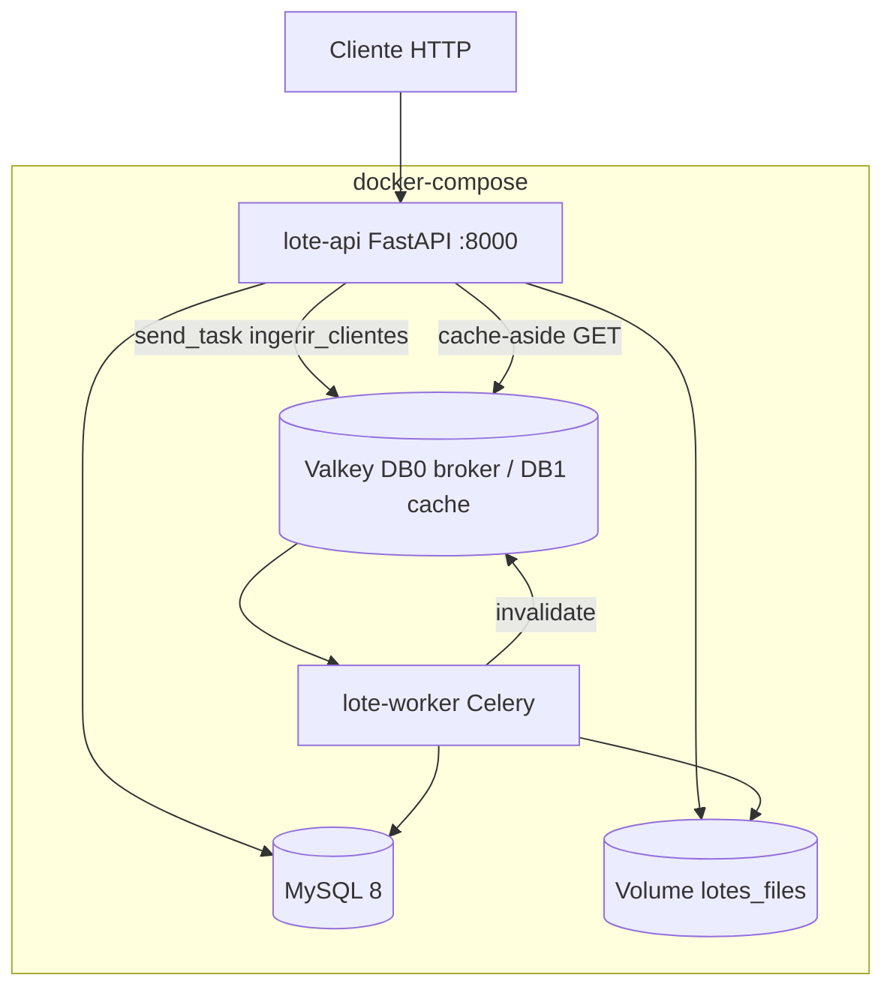
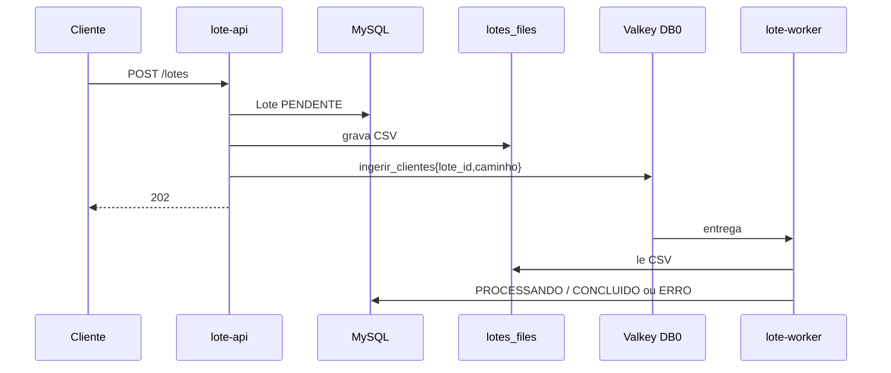

# Arquitetura do Sistema

**Estado atual**: MVP **local** (Docker Compose). Sem provisionamento AWS em código.

## Visão Geral

Monorepo com três projetos Python isolados (`lote-shared`, `lote-api`, `lote-worker`), orquestrados por um único `docker-compose.yml`. Comunicação assíncrona via Celery/Valkey; persistência MySQL; arquivos em volume compartilhado.

## Diagrama de Arquitetura (as-is)

## Diagrama de Interação — Ingestão

## Componentes

| Componente | Tipo | Papel |
|---|---|---|
| lote-api | Container / FastAPI | Borda HTTP |
| lote-worker | Container / Celery | Processamento |
| lote-shared | Biblioteca | Domínio + persistence + validação |
| MySQL | Dados | Tabela `lotes` |
| Valkey | Mensageria + cache | Broker + cache GET |
| Volume | Storage | CSV compartilhados |

## Lacunas vs alvo AWS (Fase 2 — decisões de produto)

| As-is | Alvo declarado |
|---|---|
| MySQL Compose | **RDS MySQL** |
| Porta 8000 | **API Gateway** → ALB → ECS API |
| Volume local | **S3** |
| Compose | **Terraform** + ECS Fargate |
| Valkey Compose | ElastiCache |

Nenhum `.tf` existe ainda; `infra/README.md` é esboço.
