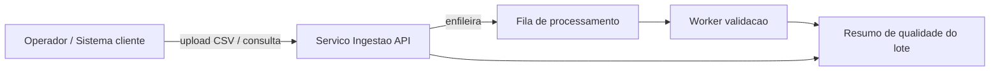

# Visão Geral de Negócio

**Ciclo**: Fase 2 — Inception migração AWS (base: MVP local existente)  
**Análise**: 2026-08-12

## Diagrama de Contexto de Negócio

## Descrição de Negócio

- **Descrição**: Serviço que recebe CSV de cadastros de clientes, processa validação de forma assíncrona e disponibiliza status/resumo do lote (totais válidos/inválidos).
- **Transações de Negócio**:
  1. **Ingerir lote** — upload CSV → lote `PENDENTE` → task assíncrona
  2. **Processar lote** — ler CSV, validar linhas, gravar `CONCLUIDO`/`ERRO`
  3. **Consultar lote** — status e contagens
  4. **Listar lotes** — histórico de ingestões
  5. **Reprocessar lote** — somente se `ERRO`
  6. **Remover lote** — apaga registro; arquivo permanece (MVP local em volume)
- **Dicionário**:
  - **Lote**: unidade de ingestão de um arquivo CSV
  - **Linha válida/inválida**: registro que passa/falha nas regras de qualidade
  - **Task `ingerir_clientes`**: unidade de trabalho assíncrona Celery

## Descrições no Nível de Componente

### lote-api (`api/`)
- **Propósito**: Porta HTTP de ingestão e consulta
- **Responsabilidades**: validar upload, persistir lote, salvar arquivo, enfileirar, CRUD de consulta

### lote-worker (`worker/`)
- **Propósito**: Processamento assíncrono de qualidade
- **Responsabilidades**: consumir fila, ler CSV, validar, atualizar status/contagens, invalidar cache

### lote-shared (`libs/`)
- **Propósito**: Domínio e contratos compartilhados
- **Responsabilidades**: entidade `Lote`, portas, repositório, cache, validadores
