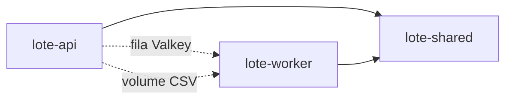

# Dependências

## Dependências Internas

### lote-api → lote-shared
- **Tipo**: Runtime (path editable)
- **Motivo**: domínio, repo, cache, exceções

### lote-worker → lote-shared
- **Tipo**: Runtime
- **Motivo**: validadores, repo, cache invalidation, entidade Lote

### lote-api ↛ lote-worker
- **Proibido** import cruzado; só fila + storage + DB

## Dependências Externas (principais)

| Dependência | Uso |
|---|---|
| fastapi / uvicorn | HTTP API |
| celery[redis] | Fila |
| sqlalchemy / pymysql | Persistência |
| redis | Cache + broker client |
| hypothesis / pytest | Testes |
| boto3 | **Ainda não** — necessário para S3 na Fase 2 |
