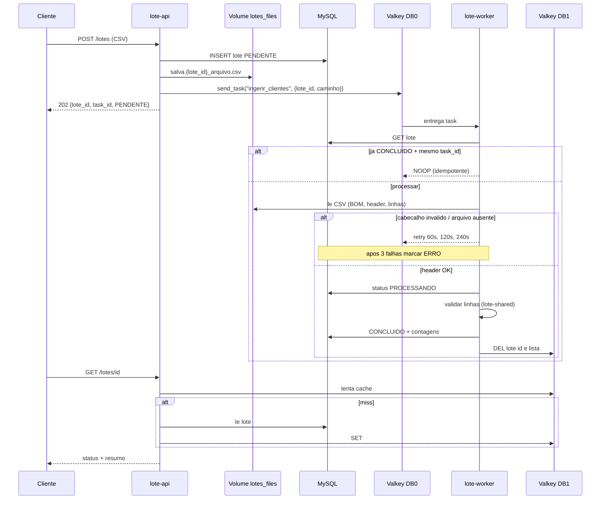

# Fluxo de execução — task `ingerir_clientes`

Diagrama do ciclo assíncrono no MVP local (API → Valkey → Worker → MySQL).

## Sequência



### Alternativa em texto (sequência)

1. Cliente faz `POST /lotes` com CSV.
2. API grava lote `PENDENTE` no MySQL e o arquivo no volume `lotes_files`.
3. API enfileira `ingerir_clientes` no Valkey DB0 com `{lote_id, caminho}` e responde `202`.
4. Worker consome a task; se já `CONCLUIDO` com o mesmo `task_id`, faz NOOP.
5. Caso contrário lê o CSV; header inválido → retry 60/120/240s → `ERRO`.
6. Header OK → `PROCESSANDO` → valida linhas → `CONCLUIDO` + contagens → invalida cache Valkey DB1.
7. Cliente consulta `GET /lotes/{id}` (cache-aside).

## Visão em camadas

```text
Cliente
   |  POST /lotes
   v
+-------------+   enqueue    +----------+
|  lote-api   |------------->| Valkey 0 |
|  FastAPI    |              |  broker  |
+------+------+              +----+-----+
       | grava CSV                | consome
       v                          v
+-------------+            +--------------+
| lotes_files |<--- le ----| lote-worker  |
+-------------+            | ingerir_...  |
                           +------+-------+
       +-------------+            |
       |   MySQL     |<-----------+ status/contagens
       +-------------+            |
       +-------------+            |
       |  Valkey 1   |<-----------+ invalidar cache
       |   cache     |
       +-------------+
```

## Código de referência

| Papel | Arquivo |
|---|---|
| Nome / allowlist API | `api/src/lote_api/application/regras_upload.py` (`TAREFA_INGERIR`) |
| Enqueue | `api/src/lote_api/infrastructure/adapters.py` (`send_task`) |
| Task worker | `worker/src/lote_worker/tasks/ingerir_clientes.py` |
| Orquestração | `worker/src/lote_worker/application/processador.py` |

## Smoke test

Ver execução prática em [`smoke-test-api.md`](smoke-test-api.md).
